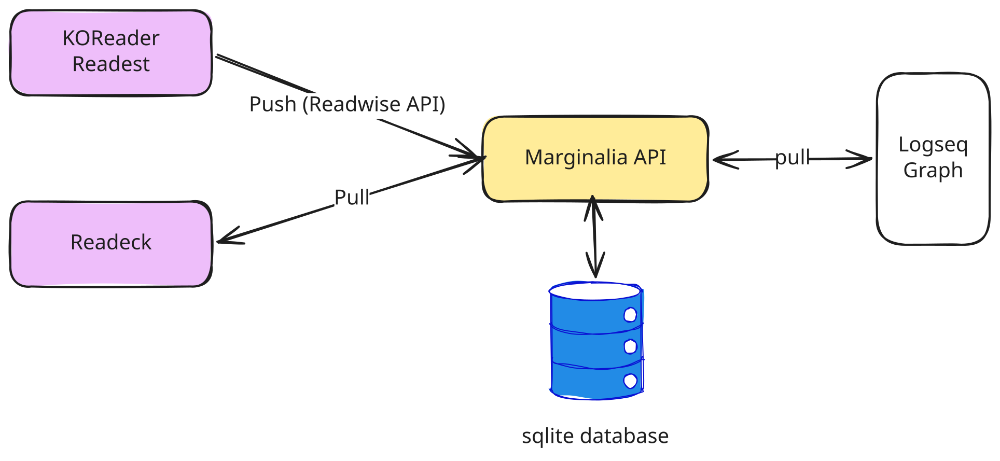

# Marginalia

> *Marginalia* (noun): notes written in the margins of a book.

A self-hosted [Readwise](https://readwise.io) replacement. Marginalia collects your
highlights from **KOReader** and **Readeck**, lets you browse and resurface them, and
syncs them into **Logseq** with fully customizable templates.


## Features

- **Collect from anywhere** — pull article highlights from [Readeck](https://readeck.org)
  and book highlights from [KOReader](https://koreader.rocks) and
  [Readest](https://readest.com) (via a Readwise-compatible endpoint, so any Readwise
  client works too).
- **Browse & search** — a clean web UI to search titles, authors, and highlight text,
  filtered by books or articles.
- **Daily review** — resurface highlights on a spaced-repetition schedule (Again / Hard /
  Good / Easy), so old notes keep coming back.
- **Customizable templates** — control exactly how pages are rendered with a
  [pongo2](https://github.com/flosch/pongo2) (Django-style) template engine, with live
  preview against sample data.
- **Logseq sync** — a companion plugin writes highlights into your graph and *preserves
  your own notes* on re-sync.
- **Self-contained** — a single static Go binary, SQLite by default (or PostgreSQL),
  distributed as a small distroless container image.

### Web UI

| Highlights & search | Document detail |
|---|---|
|  |  |

| Daily review | Templates |
|---|---|
|  |  |

The template editor renders a live preview against sample data as you type:


## How it fits together



- **KOReader** and **Readest** push book highlights to Marginalia using a
  Readwise-compatible endpoint.
- **Marginalia** pulls article highlights from your Readeck instance on demand.
- The **Logseq plugin** pulls rendered pages from Marginalia into your graph.

## Self-hosting

Marginalia ships as a multi-arch (amd64 / arm64) container image at
`ghcr.io/adampetrovic/marginalia`. The image bundles a React web UI in a single static Go
binary (~25 MB), runs as a non-root user, and stores all state in a single SQLite file
under `/data`.

Marginalia is **multi-user**: each account has its own private library of highlights and
its own API tokens for connecting devices. The first account created becomes the admin.

### Quick start (Docker)

```bash
docker run -d \
  --name marginalia \
  -p 8080:8080 \
  -v marginalia-data:/data \
  -e MARGINALIA_SESSION_SECRET="$(openssl rand -hex 32)" \
  -e DATABASE_URL=/data/marginalia.db \
  ghcr.io/adampetrovic/marginalia:latest
```

Then open `http://localhost:8080` and **create an account** — the first one becomes the
admin. To connect devices (KOReader, Readest, the Logseq plugin), generate a personal
**API token** under *Settings → API Tokens*.

> **Set `MARGINALIA_SESSION_SECRET`.** It signs login session cookies; if you don't set it
> a random secret is generated at startup, which logs everyone out on every restart. Put
> Marginalia behind a TLS-terminating reverse proxy if you expose it to the internet.

You can pre-seed the admin account (handy for automated deployments) with
`MARGINALIA_ADMIN_EMAIL` and `MARGINALIA_ADMIN_PASSWORD`, and lock down sign-ups afterward
with `MARGINALIA_DISABLE_REGISTRATION=1`.

### Docker Compose

```yaml
services:
  marginalia:
    image: ghcr.io/adampetrovic/marginalia:latest
    container_name: marginalia
    ports:
      - "8080:8080"
    environment:
      MARGINALIA_SESSION_SECRET: change-me-to-a-long-random-secret
      DATABASE_URL: /data/marginalia.db
      # Optional: pre-seed the admin account
      # MARGINALIA_ADMIN_EMAIL: you@example.com
      # MARGINALIA_ADMIN_PASSWORD: a-strong-password
      # Optional: disable public sign-ups once your accounts exist
      # MARGINALIA_DISABLE_REGISTRATION: "1"
    volumes:
      - marginalia-data:/data
    restart: unless-stopped

volumes:
  marginalia-data:
```

```bash
docker compose up -d
```

### Configuration

All configuration is via environment variables:

| Variable | Required | Default | Description |
|---|---|---|---|
| `MARGINALIA_SESSION_SECRET` | recommended | random | Secret used to sign login session cookies. If unset, a random value is generated at startup and sessions reset on every restart. |
| `DATABASE_URL` | no | `./marginalia.db` | SQLite file path, or a `postgres://...` connection string. In Docker, point this at the mounted volume (e.g. `/data/marginalia.db`). |
| `MARGINALIA_PORT` | no | `8080` | HTTP listen port. |
| `MARGINALIA_ADMIN_EMAIL` | no | — | Pre-seed the admin account's email on first run. |
| `MARGINALIA_ADMIN_PASSWORD` | no | — | Pre-seed the admin account's password on first run. |
| `MARGINALIA_DISABLE_REGISTRATION` | no | — | When set, disables public sign-up; accounts must be created by an admin. |
| `MARGINALIA_READECK_URL` | no | — | Base URL of a Readeck instance, used to seed the admin's Readeck integration on first run. Per-account config thereafter lives in *Settings → Integrations*. |
| `MARGINALIA_READECK_TOKEN` | no | — | Readeck API token (seeds the admin's integration on first run). |
| `MARGINALIA_API_TOKEN` | no | — | **Legacy.** A single shared token from older single-user deployments. On first run it is migrated to the admin account so existing devices keep working; new devices should use per-account tokens from *Settings → API Tokens*. |

A health check is available (unauthenticated) at `GET /healthz`.

#### Using PostgreSQL

By default Marginalia uses an embedded SQLite database — no extra services required.
To use PostgreSQL instead, set `DATABASE_URL` to a connection string:

```
DATABASE_URL=postgres://user:password@db:5432/marginalia?sslmode=disable
```

### Building from source

Requires Go 1.24+, Node 22+, and a C toolchain (CGO is needed for SQLite).

The web UI (a Vite/React app in `frontend/`) is built to static assets that the Go binary
embeds. A `Makefile` wires it together:

```bash
make            # build the frontend, then the Go binary -> ./marginalia
MARGINALIA_SESSION_SECRET=dev ./marginalia   # then open http://localhost:8080
```

Common targets: `make frontend` (rebuild just the UI assets into
`service/internal/web/dist/`), `make build-go` (Go binary only), `make test`, `make run`.
The built assets under `service/internal/web/dist/` are committed so the Go module always
builds; re-run `make frontend` and commit the result after changing anything in
`frontend/`.

For frontend development with hot reload, run the Vite dev server (it proxies `/api` to a
locally running Go server on port 8080):

```bash
cd frontend && npm install && npm run dev
```

Or build the container image yourself (it builds from the committed assets):

```bash
docker build -t marginalia ./service
```

## Connecting your sources

### KOReader (books)

KOReader sends highlights to Marginalia through its Readwise exporter. Use the bundled
[KOReader plugin](koreader-plugin/README.md), which is a drop-in fork of the built-in
Readwise exporter with a configurable server URL:

1. Install `readwise.lua` from the [latest release](https://github.com/adampetrovic/marginalia/releases).
2. In KOReader: **Settings → Export Highlights → Readwise**.
3. Set the **server URL** to your Marginalia instance and the **authorization token** to
   a personal API token from *Settings → API Tokens*.
4. Enable **Export to Readwise**.

### Readest (books)

Recent versions of [Readest](https://readest.com) can send highlights to a custom
Readwise-compatible endpoint ([readest#4114](https://github.com/readest/readest/issues/4114)).
In Readest:

1. Open **Settings → Integrations → Readwise** and connect.
2. Expand the **Advanced** section and set the **Custom URL** to your Marginalia instance
   with the `/api/v2` suffix, e.g. `https://marginalia.example.com/api/v2`.
3. Use a personal API token from *Settings → API Tokens* as the access token.

Readest appends `/highlights/` and `/auth/` to the base URL (with a trailing slash);
Marginalia accepts both that form and the no-trailing-slash form KOReader uses.

### Readeck (articles)

Configure your Readeck URL and token under *Settings → Integrations* (or seed the admin's
config with `MARGINALIA_READECK_URL` / `MARGINALIA_READECK_TOKEN` on first run), then
trigger a sync from the dashboard (**Sync now**) or via the API:

```bash
curl -X POST -H "Authorization: Bearer $YOUR_API_TOKEN" \
  https://marginalia.example.com/api/v1/sync
```

### Logseq

Install the [Logseq plugin](logseq-plugin/README.md) and configure it with your Marginalia
service URL and a personal API token. It pulls rendered pages into your graph, syncs
incrementally, and preserves any notes you add to highlight pages.

## API

All API routes live under `/api/v1` (plus Readwise-compatible routes under `/api/v2`) and
require authentication — either a personal API token (`Authorization: Bearer <token>`) or
a web-UI session cookie. Sign in via `POST /api/v1/auth/login` or create an account with
`POST /api/v1/auth/register`. A few useful endpoints:

| Method | Path | Description |
|---|---|---|
| `POST` | `/api/v1/sync` | Sync all configured sources |
| `GET` | `/api/v1/documents` | List documents |
| `GET` | `/api/v1/documents/{id}` | Get a document with highlights |
| `GET` | `/api/v1/export` | Export all documents as rendered pages |
| `GET` | `/api/v1/review` | Get the next due review card |
| `GET`/`POST`/`PUT` | `/api/v1/templates` | Manage rendering templates |

## Development

```bash
# Service (Go)
cd service
go test ./...

# Logseq plugin (TypeScript)
cd logseq-plugin
npm install && npm test

# End-to-end (Docker)
cd e2e
docker compose -f docker-compose.test.yml up --build -d
./run-e2e.sh
```
