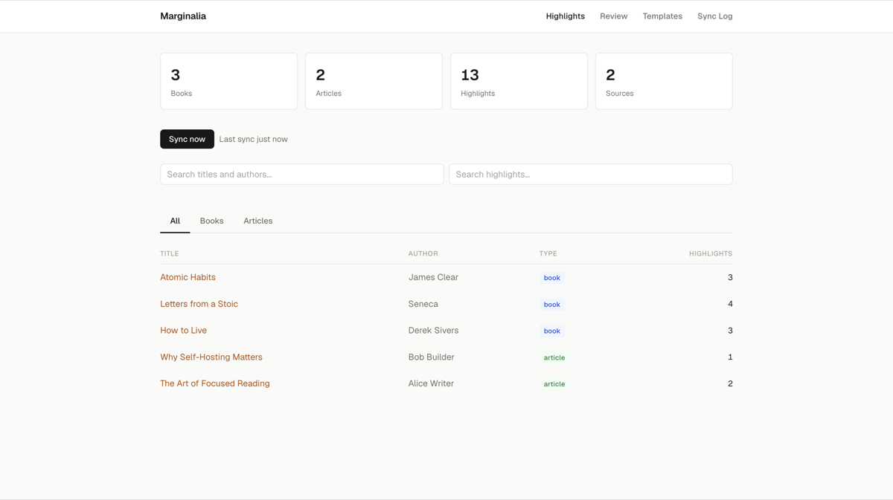
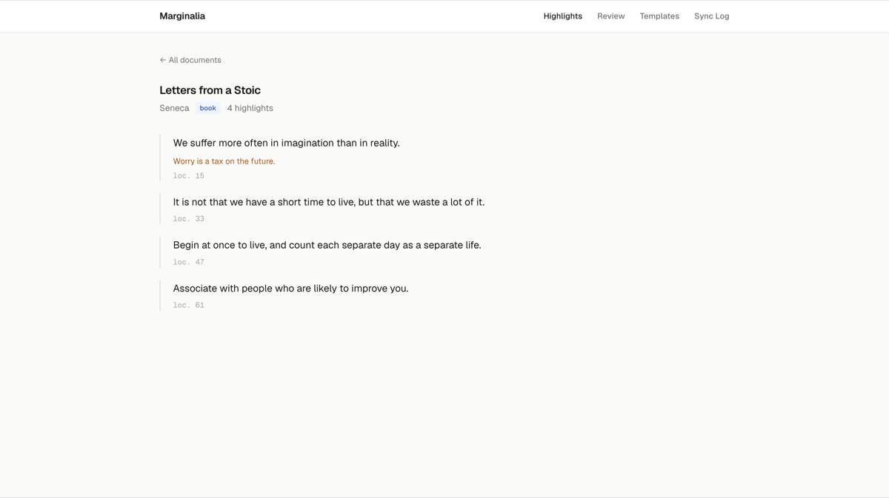
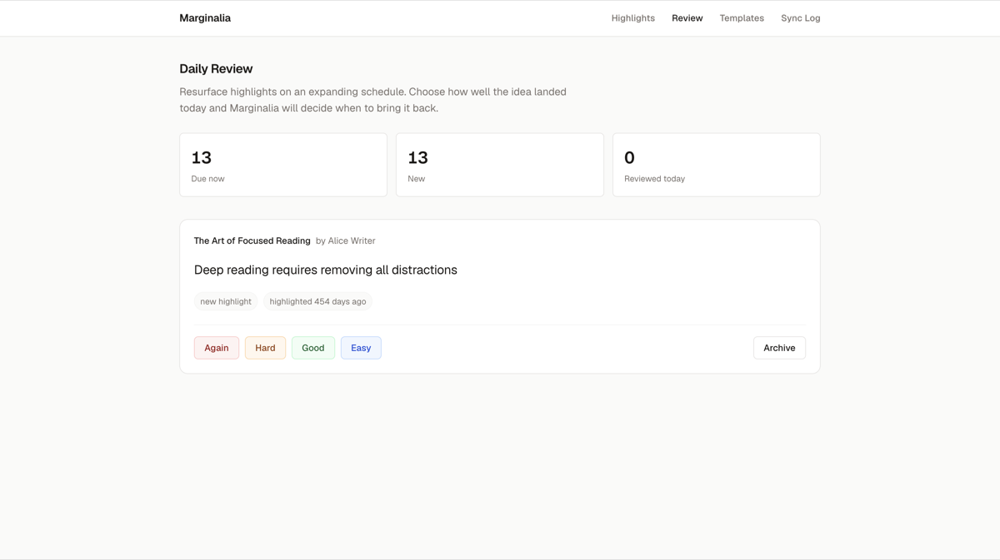
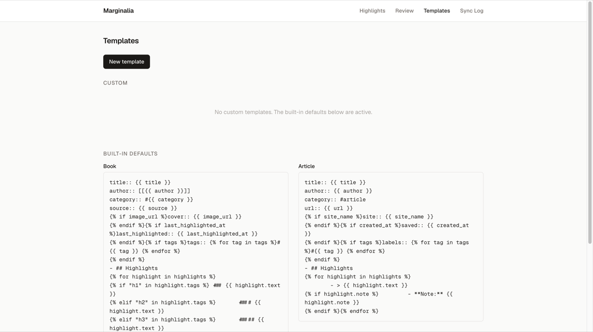
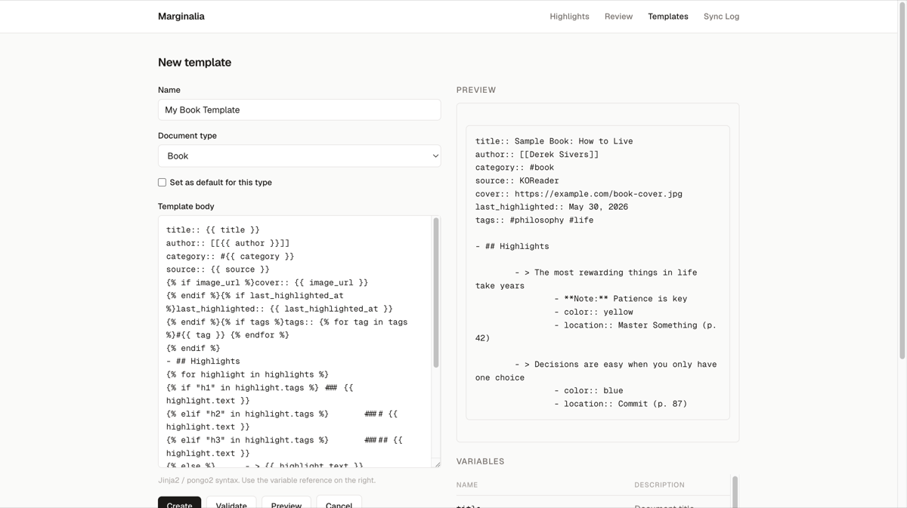

# Marginalia

> *Marginalia* (noun): notes written in the margins of a book.

A self-hosted [Readwise](https://readwise.io) replacement. Marginalia collects your
highlights from **KOReader** and **Readeck**, lets you browse and resurface them, and
syncs them into **Logseq** with fully customizable templates.



## Features

- **Collect from anywhere** — pull article highlights from [Readeck](https://readeck.org)
  and book highlights from [KOReader](https://koreader.rocks) (via a Readwise-compatible
  endpoint, so any Readwise client works too).
- **Browse & search** — a clean web UI to search titles, authors, and highlight text,
  filtered by books or articles.
- **Daily review** — resurface highlights on a spaced-repetition schedule (Again / Hard /
  Good / Easy), so old notes keep coming back.
- **Customizable templates** — control exactly how pages are rendered with a
  [pongo2](https://github.com/flosch/pongo2) (Django-style) template engine, with live
  preview against sample data.
- **Logseq sync** — a companion plugin writes highlights into your graph and *preserves
  your own notes* on re-sync.
- **Self-contained** — a single static Go binary, SQLite by default (or PostgreSQL),
  distributed as a small distroless container image.

### Web UI

| Highlights & search | Document detail |
|---|---|
|  |  |

| Daily review | Templates |
|---|---|
|  |  |

The template editor renders a live preview against sample data as you type:



## How it fits together

```
  KOReader  ──(Readwise API)──┐
                              ▼
   Readeck  ──(pull sync)──> Marginalia ──> Logseq plugin ──> your graph
                              service
                                │
                              SQLite / PostgreSQL
```

- **KOReader** pushes highlights to Marginalia using a Readwise-compatible endpoint.
- **Marginalia** pulls highlights from your Readeck instance on demand.
- The **Logseq plugin** pulls rendered pages from Marginalia into your graph.

## Self-hosting

Marginalia ships as a multi-arch (amd64 / arm64) container image at
`ghcr.io/adampetrovic/marginalia`. The image is ~15 MB, runs as a non-root user, and
stores all state in a single SQLite file under `/data`.

### Quick start (Docker)

```bash
docker run -d \
  --name marginalia \
  -p 8080:8080 \
  -v marginalia-data:/data \
  -e MARGINALIA_API_TOKEN="$(openssl rand -hex 32)" \
  -e DATABASE_URL=/data/marginalia.db \
  ghcr.io/adampetrovic/marginalia:latest
```

Then open `http://localhost:8080/?token=YOUR_API_TOKEN`. The token is stored in a cookie,
so you only need it in the URL the first time.

> **Keep your API token secret.** It is the only credential protecting the UI and API.
> Generate a long random value (e.g. `openssl rand -hex 32`) and put Marginalia behind a
> TLS-terminating reverse proxy if you expose it to the internet.

### Docker Compose

```yaml
services:
  marginalia:
    image: ghcr.io/adampetrovic/marginalia:latest
    container_name: marginalia
    ports:
      - "8080:8080"
    environment:
      MARGINALIA_API_TOKEN: change-me-to-a-long-random-secret
      DATABASE_URL: /data/marginalia.db
      # Optional: pull article highlights from Readeck
      # MARGINALIA_READECK_URL: https://readeck.example.com
      # MARGINALIA_READECK_TOKEN: your-readeck-api-token
    volumes:
      - marginalia-data:/data
    restart: unless-stopped

volumes:
  marginalia-data:
```

```bash
docker compose up -d
```

### Configuration

All configuration is via environment variables:

| Variable | Required | Default | Description |
|---|---|---|---|
| `MARGINALIA_API_TOKEN` | **yes** | — | Bearer token protecting the UI and API. Use a long random value. |
| `DATABASE_URL` | no | `./marginalia.db` | SQLite file path, or a `postgres://...` connection string. In Docker, point this at the mounted volume (e.g. `/data/marginalia.db`). |
| `MARGINALIA_PORT` | no | `8080` | HTTP listen port. |
| `MARGINALIA_READECK_URL` | no | — | Base URL of your Readeck instance. Enables Readeck sync when set with the token below. |
| `MARGINALIA_READECK_TOKEN` | no | — | Readeck API token. |

A health check is available (unauthenticated) at `GET /healthz`.

#### Using PostgreSQL

By default Marginalia uses an embedded SQLite database — no extra services required.
To use PostgreSQL instead, set `DATABASE_URL` to a connection string:

```
DATABASE_URL=postgres://user:password@db:5432/marginalia?sslmode=disable
```

### Building from source

Requires Go 1.24+ and a C toolchain (CGO is needed for SQLite).

```bash
cd service
CGO_ENABLED=1 go build -o marginalia ./cmd/marginalia
MARGINALIA_API_TOKEN=dev-token ./marginalia
```

Or build the container image yourself:

```bash
docker build -t marginalia ./service
```

## Connecting your sources

### KOReader (books)

KOReader sends highlights to Marginalia through its Readwise exporter. Use the bundled
[KOReader plugin](koreader-plugin/README.md), which is a drop-in fork of the built-in
Readwise exporter with a configurable server URL:

1. Install `readwise.lua` from the [latest release](https://github.com/adampetrovic/marginalia/releases).
2. In KOReader: **Settings → Export Highlights → Readwise**.
3. Set the **server URL** to your Marginalia instance and the **authorization token** to
   your `MARGINALIA_API_TOKEN`.
4. Enable **Export to Readwise**.

### Readeck (articles)

Set `MARGINALIA_READECK_URL` and `MARGINALIA_READECK_TOKEN`, then trigger a sync from the
dashboard (**Sync now**) or via the API:

```bash
curl -X POST -H "Authorization: Bearer $MARGINALIA_API_TOKEN" \
  https://marginalia.example.com/api/v1/sync
```

### Logseq

Install the [Logseq plugin](logseq-plugin/README.md) and configure it with your Marginalia
service URL and API token. It pulls rendered pages into your graph, syncs incrementally,
and preserves any notes you add to highlight pages.

## API

All API routes live under `/api/v1` (plus Readwise-compatible routes under `/api/v2`) and
require the bearer token. A few useful endpoints:

| Method | Path | Description |
|---|---|---|
| `POST` | `/api/v1/sync` | Sync all configured sources |
| `GET` | `/api/v1/documents` | List documents |
| `GET` | `/api/v1/documents/{id}` | Get a document with highlights |
| `GET` | `/api/v1/export` | Export all documents as rendered pages |
| `GET` | `/api/v1/review` | Get the next due review card |
| `GET`/`POST`/`PUT` | `/api/v1/templates` | Manage rendering templates |

## Development

```bash
# Service (Go)
cd service
go test ./...

# Logseq plugin (TypeScript)
cd logseq-plugin
npm install && npm test

# End-to-end (Docker)
cd e2e
docker compose -f docker-compose.test.yml up --build -d
./run-e2e.sh
```
